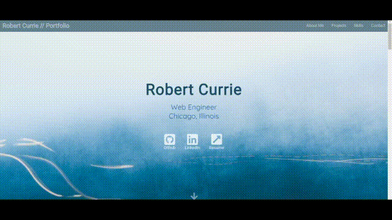

# My Portfolio

### [Link](robertcurrie.netlify.com) to live app

 Personal portfolio made using all custom and responsive HTML, CSS, and JavaScript
 
 ### Demo
 

### Getting Started
* Create an account or sign in with Gmail
* Create a stream (you can make multiple on one account)
* Connect with your local streaming software

### Technologies
* HTML5
* CSS3
* JavaScript ES10
* [Font Awesome](https://fontawesome.com/) 5.12.0
* [Smooth Scroll](https://github.com/cferdinandi/smooth-scroll) 15.1.3
* [Animated on Scroll](https://michalsnik.github.io/aos/) 2.3.1

### Installing

1. Clone the repo into a folder
> git clone https://github.com/R-Currie/current-portfolio.git
2. Load up the index
> open index.html
3. Enjoy!
